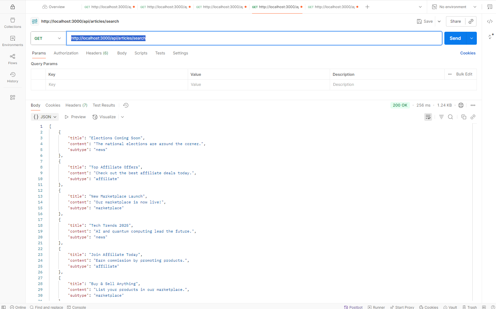
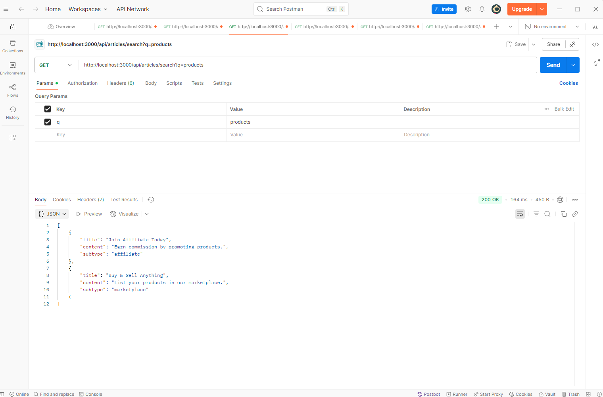
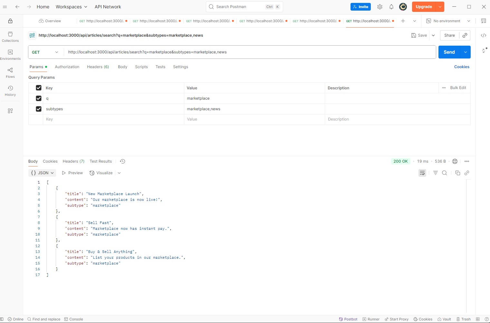

# Node.js Elasticsearch Example

This project demonstrates how to use [Elasticsearch](https://www.elastic.co/) with a Node.js backend. It provides a REST API to search articles stored in Elasticsearch.

## Prerequisites

- [Node.js](https://nodejs.org/) (v14 or higher recommended)
- [Elasticsearch](https://www.elastic.co/downloads/elasticsearch)

## Running Elasticsearch on Windows

1. **Open Command Prompt:**
   - Press `Win + R`, type `cmd`, and hit Enter.

2. **Navigate to the Elasticsearch bin directory:**
   ```sh
   cd C:\elasticsearch-9.0.1\bin
   ```

3. **Start Elasticsearch:**
   ```sh
   elasticsearch.bat
   ```

   Elasticsearch will start and be available at [http://localhost:9200/](http://localhost:9200/).

## Setup

1. **Clone the repository**

   ```sh
   git clone <your-repo-url>
   cd <your-project-directory>
   ```

2. **Install dependencies**

   ```sh
   npm install
   ```

3. **Configure environment variables**

   The `.env` file is already provided:

   ```
   ES_NODE=http://localhost:9200
   ES_INDEX=articles
   PORT=3000
   ```

   Adjust values if needed.

4. **Seed sample data into Elasticsearch**

   This will create the `articles` index and add sample articles.

   ```sh
   node data/seed.js
   ```

5. **Start the server**

   ```sh
   node server.js
   ```

   The server will run at [http://localhost:3000](http://localhost:3000).

## API Usage

### Search Articles

- **Endpoint:** `GET /api/articles/search`
- **Query Parameters:**
  - `q` (optional): Search term for article content.
  - `subtypes` (optional): Comma-separated list of subtypes (e.g., `news,affiliate`).

**Example:**

```
GET http://localhost:3000/api/articles/search?q=marketplace&subtypes=marketplace,news
```

**Response:**

Returns a JSON array of matching articles.

## Project Structure

- [`server.js`](server.js): Express server setup.
- [`elasticClient.js`](elasticClient.js): Elasticsearch client configuration.
- [`routes/articles.js`](routes/articles.js): Article search API route.
- [`data/seed.js`](data/seed.js): Script to seed sample data.
- [`.env`](.env): Environment variables.

##

Screenshots of REST API in at POSTMAN





